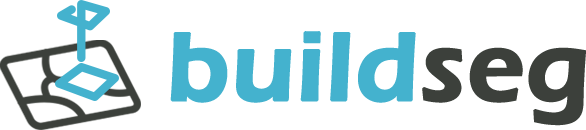

<div align="center">
    <article style="display: flex; flex-direction: column; align-items: center; justify-content: center;">
        <p align="center"></p>
        <h1 style="width: 100%; text-align: center;">buildseg: QGIS plugin for building extraction</h1>
    </article>
    English | <a href="./docs/README_CN.md">简体中文</a>
</div>

<br/>

[](https://www.python.org/downloads/release/python-380/) [](https://www.paddlepaddle.org.cn/install/quick?docurl=/documentation/docs/en/install/pip/windows-pip_en.html) [](https://www.qgis.org/)  

buildseg is a Building Extraction plugin for QGIS based on PaddlePaddle, and it useing the semantic segmentation ability provided by paddleseg, large areas can be extracted and spliced.

|                       OCRNet HRNet_W18                       |                         SegFormer_B2                         |
| :----------------------------------------------------------: | :----------------------------------------------------------: |
|  |  |

*\*Noto : raster size is 4983x3475.*

## How to use

1. Download and install [QGIS](https://www.qgis.org/en/site/) and clone the repo :
``` git
git clone git@github.com:deepbands/buildseg.git
```

2. Install requirements :
   - Enter the folder and install dependent libraries using OSGeo4W shell (Open As Administrator) :
   ``` shell
   cd buildseg
   pip install -r requirements.txt
   ```
   - Or open OSGeo4W shell as administrator and enter :
    ``` shell
    pip install opencv-python paddlepaddle>=2.2.0 paddleseg --user
    ```

3. Copy folder named buildseg in QGIS configuration folder and choose the plugin from plugin manager in QGIS (If not appeared restart QGIS).
   - You can know this folder from QGIS Setting Menu at the top-left of QGIS UI `Settings > User Profiles > Open Active Profile Folder` .
   - Go to `python/plugins` then paste the buildseg folder.
   - Full path should be like : `C:\Users\$USER\AppData\Roaming\QGIS\QGIS3\profiles\default\python\plugins\buildseg`.

4. Open QGIS, load your raster and select the parameter file ([*.pdiparams](https://cloud.a-boat.cn:2021/share/3xda5wmV)) then click `ok`. 

## Model and Parameter

|                    Model                    | Backbone  | Resolution |  mIoU  | Params(MB) | Inference Time(ms) |                        Static Weight                         |
| :-----------------------------------------: | :-------: | :--------: | :----: | :--------: | :----------------: | :----------------------------------------------------------: |
|     [OCRNet](./docs/network/OCRNet.md)      | HRNet_W18 |  512x512   | 89.38% |    46.2    |         /          | [Baidu drive](https://pan.baidu.com/s/1aQVc3InoUmxoGKSHCitvBw) \| [Google drive](https://drive.google.com/file/d/1LkwvAfIWf_RO4ybSAc_7yLm4hNp_sWjD/view?usp=sharing) |
| [SegFormer_B2](./docs/network/SegFormer.md) |     -     |  512x512   | 89.47% |    104     |         /          | [Baidu drive](https://pan.baidu.com/s/1QohTl65OmYOU__ESQjcAcg) \| [Google drive](https://drive.google.com/file/d/1Kihnb5yRK0-aNnD_ZHgWUmLJqMzJKq_L/view?usp=sharing) |

- \*Note : All of Baidu drive's code is : band.
- Train/Eval(5k) Dataset : [Link](https://aistudio.baidu.com/aistudio/datasetdetail/102929).
- We have done all testing and development using : Tesla V100 32G in [AI Studio](https://aistudio.baidu.com/aistudio/index).

## TODO

### v0.2

- [x] Environment dependency package check.
- [x] Add another model, like Vision Transform.
- [ ] Add note about different model characteristics.
- [ ] Accelerate:
    - [ ] PaddlePaddle setting.
    - [ ] Add maximum pixelsize to calculate / using GDAL 'translat / warp' to make raster smaller.
    - [ ] Block stacking and saving.
- [ ] Add online map tiles support:
    - [ ] Extract building on raster in memory.
    - [ ] Add vector range selection.
- [x] Test on Windows 10/11
- [ ] Test on Linux
- [ ] Test On macOS Big Sur+
